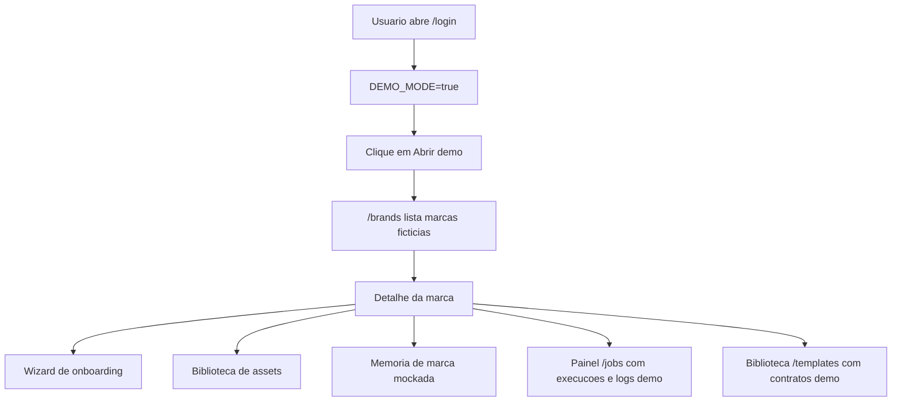
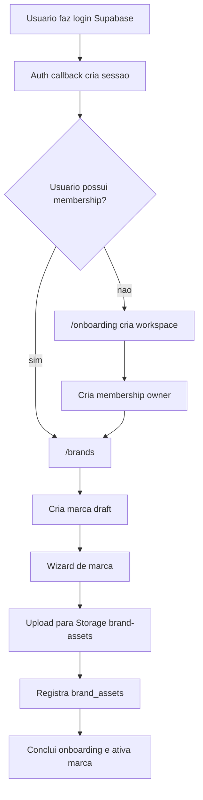
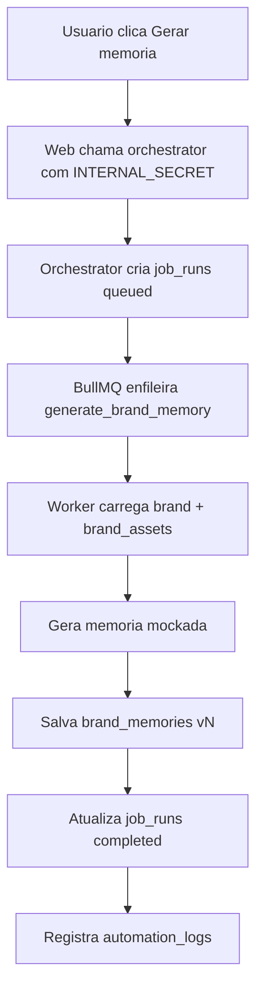
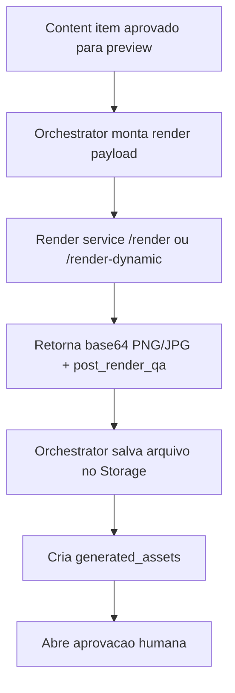

# Diagnostico atual do Content SaaS

Atualizado em: 2026-06-02

## 1. Resumo executivo

O `content-saas` e um novo monorepo para transformar o fluxo operacional de criacao de social media em um SaaS com login, workspace, marcas, upload estruturado de assets, memoria de marca, jobs assincronos e renderizacao de previews.

Estado atual:

- Monorepo criado e publicado em `fabiohhsales/content-saas`.
- `apps/web` roda localmente em modo demo sem Supabase real.
- `apps/orchestrator` possui API interna e worker BullMQ para `generate_brand_memory`.
- `apps/render` foi importado do render-service oficial e manteve os endpoints de render.
- Migrations Supabase foram criadas com tabelas, RLS multi-tenant e bucket privado `brand-assets`.
- Contratos Zod compartilhados vivem em `packages/contracts`.

O produto novo foi desenhado para usar Supabase como fonte de verdade e Redis/BullMQ para jobs. n8n, ClickUp e Google Drive ficaram fora do caminho central.

## 2. Estrutura do monorepo

```text
content-saas/
  apps/
    web/             Next.js App Router, UI, auth, onboarding, marcas e assets
    orchestrator/    API interna, BullMQ, workers e jobs de IA/render
    render/          Playwright render service HTML/CSS -> PNG/JPG
  packages/
    contracts/       Schemas Zod compartilhados
    supabase/        Helpers e client Supabase
  supabase/
    migrations/      Schema Postgres, RLS e Storage policies
  docs/
    DIAGNOSTICO-ATUAL.md
```

Scripts principais na raiz:

```bash
npm run dev:web
npm run dev:orchestrator
npm run dev:render
npm run worker:orchestrator
npm run typecheck
npm test
npm run build
```

## 3. Apps e responsabilidades

### 3.1 Web (`apps/web`)

Responsavel pela experiencia do usuario:

- Login por Supabase Auth.
- Callback de auth em `/auth/callback`.
- Onboarding de workspace em `/onboarding`.
- Listagem e criacao de marcas em `/brands`.
- Detalhe/edicao de marca em `/brands/[brandId]`.
- Wizard de onboarding da marca em `/brands/[brandId]/onboarding`.
- Biblioteca de assets em `/brands/[brandId]/assets`.
- Biblioteca de templates em `/templates` e detalhe em `/templates/[templateId]`.
- Painel de jobs/logs em `/jobs`, com filtros e retry manual para jobs suportados.
- Healthcheck em `/api/health`.

Arquivos-chave:

- `apps/web/src/lib/auth.ts`: autentica usuario ou injeta usuario demo.
- `apps/web/src/lib/demo.ts`: dados ficticios para navegacao local.
- `apps/web/src/lib/supabase.ts`: client Supabase SSR.
- `apps/web/src/app/brands/actions.ts`: server actions de marcas, assets e memoria.
- `apps/web/src/app/templates/page.tsx`: biblioteca de templates.
- `apps/web/src/app/templates/[templateId]/page.tsx`: detalhe de contrato/campos do template.
- `apps/web/src/app/jobs/page.tsx`: painel operacional de jobs e logs.
- `apps/web/src/components/app-shell.tsx`: shell de navegacao.

Modo demo:

- Ativado por `DEMO_MODE=true`.
- Permite navegar sem Supabase configurado.
- Cria workspace, marcas, assets e memoria mockados em memoria estatica.
- Atualmente serve para avaliacao de fluxo/UX, nao para persistencia real.

### 3.2 Orchestrator (`apps/orchestrator`)

Responsavel por API interna e jobs assincronos:

- `GET /health`: status do servico.
- `POST /jobs/generate-brand-memory`: cria `job_runs` e enfileira job BullMQ.
- `GET /jobs/:id`: consulta status do job.
- `POST /jobs/:id/retry`: cria nova execucao a partir de job falho suportado.
- Worker `brand-memory` consome fila e executa `generate_brand_memory`.

Arquivos-chave:

- `apps/orchestrator/src/index.ts`: API Express.
- `apps/orchestrator/src/worker.ts`: worker BullMQ.
- `apps/orchestrator/src/jobs/generate-brand-memory.ts`: job mockado.
- `apps/orchestrator/src/queues.ts`: conexao Redis e filas.
- `apps/orchestrator/src/supabase.ts`: client Supabase service role.

Estado atual do job `generate_brand_memory`:

- Recebe `{ workspace_id, brand_id, requested_by }`.
- Busca marca e assets no Supabase.
- Gera memoria mockada deterministica.
- Salva nova versao em `brand_memories`.
- Atualiza `job_runs` para `completed` ou `failed`.
- Registra eventos em `automation_logs`.

### 3.3 Render (`apps/render`)

Responsavel por transformar templates HTML/CSS em imagens:

- `GET /health`
- `GET /templates`
- `GET /templates/:id/schema`
- `POST /render`
- `POST /render-dynamic`
- `POST /render-carousel`

Estado atual:

- Codigo importado do `healthgrow-render-service`.
- Templates HTML foram copiados para `apps/render/templates-html`.
- Render usa Playwright/Chromium.
- Suporta `output_format: "png" | "jpg"`, mantendo `png` como default.
- Smoke tests renderizam todos os templates locais.

Arquivos-chave:

- `apps/render/src/index.ts`: API Express.
- `apps/render/src/renderer.ts`: Playwright, hidratacao e screenshot.
- `apps/render/src/types.ts`: contratos internos de render.
- `apps/render/test/smoke.test.ts`: testes de render.

## 4. Pacotes compartilhados

### 4.1 Contracts (`packages/contracts`)

Contem schemas Zod e tipos para:

- Workspaces e members.
- Brands e brand assets.
- Brand memories.
- Templates.
- Content plans e content items.
- Render requests/responses.
- Job runs e approvals.
- Payload do job `generate_brand_memory`.

Principio atual:

- Todos os JSONB persistidos devem ter `schema_version`.
- O contrato de IA/render deve ser preservado mesmo quando a implementacao ainda estiver mockada.

### 4.2 Supabase helpers (`packages/supabase`)

Contem:

- Helper `createBrowserSupabaseClient`.
- Helper `createServiceSupabaseClient`.
- Helper `brandAssetPath`.
- Tipos parciais de tabelas principais.

Observacao:

- O client esta flexivel para acelerar a fundacao. A proxima melhoria tecnica e gerar tipos reais via Supabase CLI quando o projeto estiver conectado.

## 5. Banco de dados e RLS

Migration principal:

```text
supabase/migrations/202606010001_foundation.sql
```

Tabelas criadas:

- `workspaces`
- `members`
- `brands`
- `brand_assets`
- `brand_memories`
- `templates`
- `brand_templates`
- `content_plans`
- `content_items`
- `generated_assets`
- `approvals`
- `job_runs`
- `automation_logs`

Enums criados:

- `workspace_role`: owner, admin, editor, viewer
- `brand_status`: draft, active, archived
- `asset_category`: logo, photo, font, reference, document, other
- `asset_status`: uploaded, processing, ready, failed, archived
- `plan_status`
- `content_item_status`
- `approval_status`
- `job_run_status`
- `log_level`

RLS:

- Usuario so acessa dados se for membro do workspace.
- Escrita em marcas/assets/conteudo fica restrita a owner/admin/editor.
- Workspace e members ficam restritos a owner/admin, com excecao da criacao inicial do owner.
- Templates globais podem ser lidos quando `workspace_id is null`.

Storage:

- Bucket privado `brand-assets`.
- Path canonico: `workspace_id/brand_id/category/file`.
- Policies validam membership usando o primeiro segmento do path.

## 6. Fluxos atuais do sistema

### 6.1 Fluxo demo local



Objetivo:

- Permitir avaliacao visual e funcional sem Supabase, Redis ou auth real.

Limitacao:

- Form actions em demo simulam comportamento e redirecionam.
- Nada e persistido.

### 6.2 Fluxo real planejado de onboarding



### 6.3 Fluxo real de memoria de marca



### 6.4 Fluxo futuro de render



## 7. Rotas atuais

### Web

| Rota | Estado | Observacao |
|---|---|---|
| `/login` | funcional | Supabase OTP ou demo |
| `/auth/callback` | funcional | troca code por session |
| `/` | funcional | redireciona conforme workspace |
| `/onboarding` | funcional | cria workspace real |
| `/brands` | funcional | lista/cria marcas; demo ativo |
| `/brands/[brandId]` | funcional | edita marca e mostra memorias |
| `/brands/[brandId]/onboarding` | funcional | wizard inicial |
| `/brands/[brandId]/assets` | funcional | biblioteca e upload |
| `/templates` | funcional | biblioteca de templates; demo ativo |
| `/templates/[templateId]` | funcional | detalhe de campos, slots e contrato |
| `/jobs` | funcional | painel de job_runs e automation_logs, filtros e retry; demo ativo |
| `/api/health` | funcional | healthcheck web |

### Orchestrator

| Rota | Estado | Observacao |
|---|---|---|
| `GET /health` | funcional | healthcheck |
| `POST /jobs/generate-brand-memory` | implementada | exige `x-internal-secret` |
| `GET /jobs/:id` | implementada | consulta `job_runs` |
| `POST /jobs/:id/retry` | implementada | retry para `generate_brand_memory` falho |

### Render

| Rota | Estado | Observacao |
|---|---|---|
| `GET /health` | funcional | lista templates |
| `GET /templates` | funcional | templates locais |
| `GET /templates/:id/schema` | funcional | schema JSON |
| `POST /render` | funcional | valida contrato compartilhado |
| `POST /render-dynamic` | funcional | HTML/CSS/schema no payload |
| `POST /render-carousel` | funcional | ate 10 slides |

## 8. Ambiente local

Portas convencionadas:

- Web: `3000`
- Render: `3001`
- Orchestrator: `3002`
- Redis: `6379`

Modo demo atual:

```text
apps/web/.env.local
DEMO_MODE=true
```

Comando usado para subir web:

```bash
npm run dev:web
```

No Windows/sandbox do Codex, o Next precisou ser iniciado diretamente pelo binario local:

```powershell
node_modules\.bin\next.cmd dev apps/web --hostname 127.0.0.1 -p 3000
```

URL atual:

```text
http://127.0.0.1:3000/login
```

## 9. Validacoes realizadas

Comandos ja executados com sucesso:

```bash
npm run typecheck
npm test
npm run build
```

Cobertura atual:

- Typecheck nos pacotes e apps.
- Smoke tests do render com templates locais.
- Teste de contrato do job `generate_brand_memory`.
- Build Next de producao.

Rotas demo verificadas com HTTP 200:

- `/login`
- `/brands`
- `/brands/demo-brand-health-grow`
- `/brands/demo-brand-health-grow/onboarding`
- `/brands/demo-brand-health-grow/assets`
- `/templates`
- `/templates/photo-overlay-01`
- `/jobs`

## 10. Diagnostico de maturidade

### Pronto para avaliacao de produto

- Navegacao demo local.
- Estrutura de marca e assets.
- Biblioteca inicial de templates.
- Memoria de marca mockada.
- Painel inicial de jobs/logs no web.
- Arquitetura de monorepo.
- Render service importado e testado.

### Pronto parcialmente

- Supabase schema/RLS: criado, mas ainda precisa ser aplicado/testado contra um projeto Supabase real/local.
- Orchestrator: implementado, mas precisa Redis + Supabase real para fluxo ponta a ponta.
- Upload real: implementado no web, mas depende de Supabase Storage configurado.
- Jobs: contrato, worker, painel visual e retry inicial existem, mas falta integracao ponta a ponta real em ambiente com Redis/Supabase.

### Ainda nao implementado

- IA real para memoria de marca.
- CRUD de content plans e content items.
- Tela de approvals.
- Render preview integrado ao web/orchestrator.
- Gestao de membros do workspace.
- CI GitHub Actions.
- Testes SQL/RLS automatizados.

## 11. Riscos e pontos de atencao

1. Tipos Supabase ainda sao parciais.
   - Recomendacao: gerar tipos com Supabase CLI apos aplicar migrations.

2. RLS precisa ser validado em banco real.
   - Recomendacao: criar suite SQL com usuarios/workspaces diferentes.

3. Modo demo nao persiste alteracoes.
   - Recomendacao: manter assim para demo rapida ou evoluir para seed local com Supabase.

4. Web chama orchestrator por `INTERNAL_SECRET`.
   - Recomendacao: revisar modelo quando houver deploy, para evitar expor segredos ao client. Hoje a chamada e server action.

5. Render ainda retorna base64.
   - Recomendacao: para producao, salvar direto no Storage via orchestrator e retornar referencia.

6. `.env.local` existe localmente e nao deve ser commitado.
   - `.gitignore` ja cobre `.env.local`.

## 12. Proximos passos recomendados

Ordem sugerida:

1. Criar setup Supabase local com CLI e aplicar migration.
2. Gerar tipos Supabase reais e substituir os tipos parciais.
3. Criar seed real para workspace, marca, assets e memoria.
4. Subir Supabase/Redis local e validar fluxo real de `generate_brand_memory`.
5. Integrar `generate_brand_memory` real com provider IA.
6. Criar fluxo de render preview e salvar em `generated_assets`.
7. Implementar approvals para memoria, plano e asset gerado.
8. Criar CRUD de content plans e content items.
9. Adicionar CI no GitHub Actions.

## 13. Checklist de handoff

- Repo remoto: `https://github.com/fabiohhsales/content-saas.git`
- Branch principal: `main`
- App local atual: `http://127.0.0.1:3000/login`
- Demo mode: ativo localmente
- Commit base: `b33d53e initial content saas foundation`
- Commit demo: `2352a0c add local demo mode`
