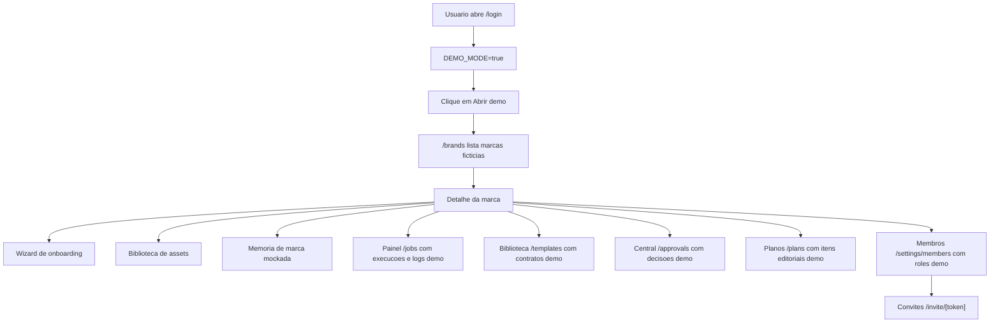
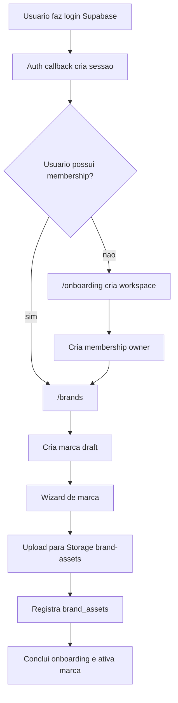
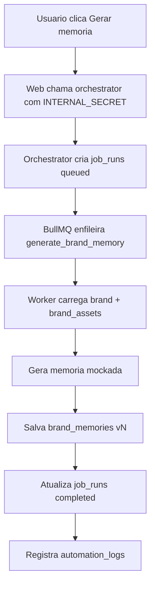
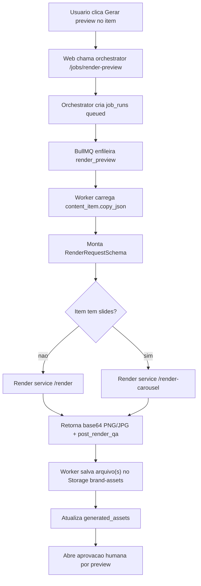
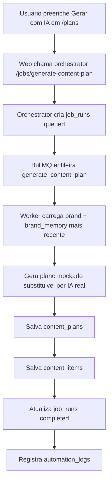
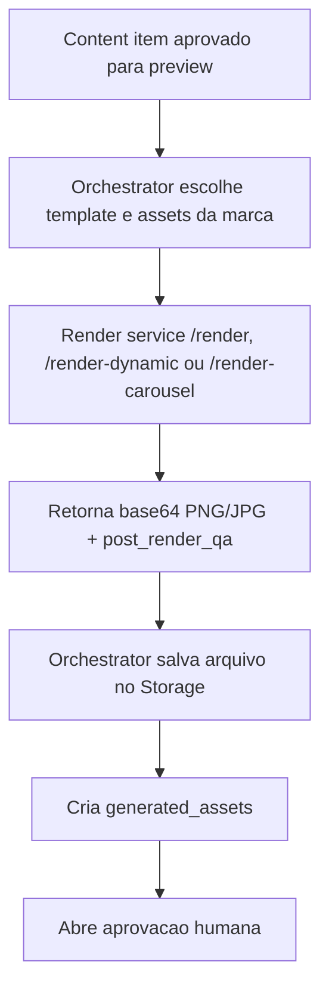
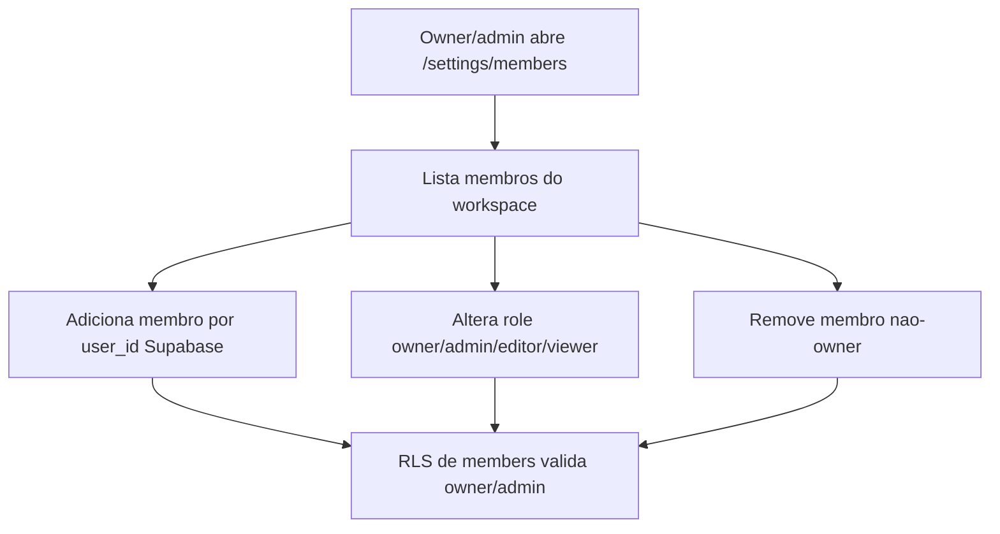
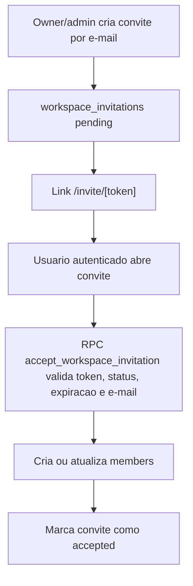
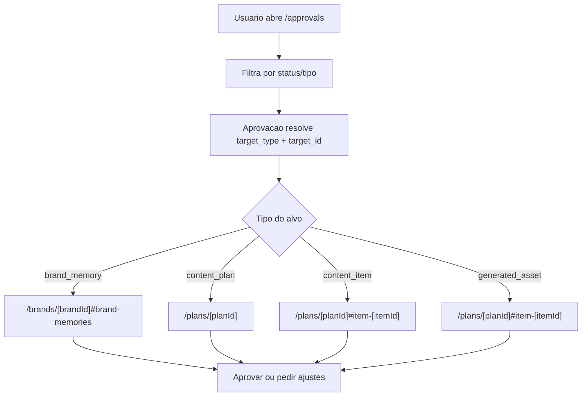

# Diagnostico atual do Content SaaS

Atualizado em: 2026-06-03

## 1. Resumo executivo

O `content-saas` e um novo monorepo para transformar o fluxo operacional de criacao de social media em um SaaS com login, workspace, marcas, upload estruturado de assets, memoria de marca, jobs assincronos e renderizacao de previews.

Estado atual:

- Monorepo criado e publicado em `fabiohhsales/content-saas`.
- `apps/web` roda localmente em modo demo sem Supabase real.
- `apps/orchestrator` possui API interna e workers BullMQ para `generate_brand_memory` e `generate_content_plan`.
- `apps/orchestrator` tambem possui fila inicial `render-preview` para gerar previews e abrir aprovacoes.
- `apps/render` foi importado do render-service oficial e manteve os endpoints de render.
- Migrations Supabase foram criadas com tabelas, RLS multi-tenant e bucket privado `brand-assets`.
- Contratos Zod compartilhados vivem em `packages/contracts`.
- CI GitHub Actions roda typecheck, testes e build no monorepo.

O produto novo foi desenhado para usar Supabase como fonte de verdade e Redis/BullMQ para jobs. n8n, ClickUp e Google Drive ficaram fora do caminho central.

## 2. Estrutura do monorepo

```text
content-saas/
  apps/
    web/             Next.js App Router, UI, auth, onboarding, marcas e assets
    orchestrator/    API interna, BullMQ, workers e jobs de IA/render
    render/          Playwright render service HTML/CSS -> PNG/JPG
  packages/
    contracts/       Schemas Zod compartilhados
    supabase/        Helpers e client Supabase
  supabase/
    migrations/      Schema Postgres, RLS e Storage policies
  .github/
    workflows/       CI do monorepo
  docs/
    DIAGNOSTICO-ATUAL.md
    PLANO-REDESENHO-CLIENTE-FIRST.md
    PLANO-MVP-EDITOR-VISUAL.md
```

Scripts principais na raiz:

```bash
npm run dev:web
npm run dev:orchestrator
npm run dev:render
npm run worker:orchestrator
npm run typecheck
npm test
npm run build
```

## 3. Apps e responsabilidades

### 3.1 Web (`apps/web`)

Responsavel pela experiencia do usuario:

- Login por Supabase Auth.
- Callback de auth em `/auth/callback`.
- Onboarding de workspace em `/onboarding`.
- Painel cliente-first em `/clients`.
- Hub operacional do cliente em `/clients/[clientId]`.
- Listagem e criacao de marcas em `/brands`.
- Detalhe/edicao de marca em `/brands/[brandId]`.
- Wizard de onboarding da marca em `/brands/[brandId]/onboarding`.
- Biblioteca de assets em `/brands/[brandId]/assets`.
- Planejamento de conteudo em `/plans` e `/plans/[planId]`.
- Editor assistido em `/editor` e `/editor/[documentId]`.
- Biblioteca de templates em `/templates` e detalhe em `/templates/[templateId]`.
- Central de aprovacoes em `/approvals`.
- Links de aprovacao para memoria, plano, item e asset gerado.
- Painel de jobs/logs em `/jobs`, com filtros e retry manual para jobs suportados.
- Disparo de render preview a partir dos itens de `/plans/[planId]`.
- Gestao de membros e convites em `/settings/members`.
- Aceite de convite em `/invite/[token]`.
- Healthcheck em `/api/health`.

Arquivos-chave:

- `apps/web/src/lib/auth.ts`: autentica usuario ou injeta usuario demo.
- `apps/web/src/lib/demo.ts`: dados ficticios para navegacao local.
- `apps/web/src/lib/supabase.ts`: client Supabase SSR.
- `apps/web/src/app/clients/page.tsx`: painel cliente-first com setup visual, progresso e atalhos operacionais.
- `apps/web/src/app/clients/[clientId]/page.tsx`: hub interno do cliente com briefing, identidade, assets com metadata, memoria, estrategia, templates vinculados e transicao para editor.
- `apps/web/src/app/brands/actions.ts`: server actions de marcas, assets, metadata de assets, memoria e vinculo de templates por cliente.
- `apps/web/src/app/plans/page.tsx`: lista, filtros e criacao de planos de conteudo.
- `apps/web/src/app/plans/[planId]/page.tsx`: detalhe do plano, itens planejados e status.
- `apps/web/src/app/plans/actions.ts`: server actions de planos, itens e aprovacao.
- `apps/web/src/app/editor/page.tsx`: lista documentos criativos editaveis derivados de previews.
- `apps/web/src/app/editor/[documentId]/page.tsx`: carrega dados, auth e contratos do documento criativo.
- `apps/web/src/app/editor/[documentId]/editor-client.tsx`: workbench visual client-side com canvas selecionavel, camadas, painel de propriedades, assets e versoes.
- `apps/web/src/app/editor/actions.ts`: salva edicoes de elementos, cria versoes e envia documentos criativos para aprovacao.
- `docs/PLANO-REDESENHO-CLIENTE-FIRST.md`: plano de redesenho completo do fluxo por cliente.
- `docs/PLANO-MVP-EDITOR-VISUAL.md`: planejamento da evolucao do editor assistido para um MVP visual tipo Canva controlado.
- `apps/web/src/app/templates/page.tsx`: biblioteca de templates.
- `apps/web/src/app/templates/[templateId]/page.tsx`: detalhe de contrato/campos do template.
- `apps/web/src/app/approvals/page.tsx`: central de aprovacao humana com links para alvos.
- `apps/web/src/app/approvals/actions.ts`: acoes de aprovar ou pedir ajustes.
- `apps/web/src/app/jobs/page.tsx`: painel operacional de jobs e logs.
- `apps/web/src/app/settings/members/page.tsx`: membros, convites, papeis e permissao do workspace.
- `apps/web/src/app/settings/members/actions.ts`: convidar, aceitar, revogar, adicionar, alterar papel e remover membros.
- `apps/web/src/app/invite/[token]/page.tsx`: aceite autenticado de convite.
- `apps/web/src/components/app-shell.tsx`: shell de navegacao.

Modo demo:

- Ativado por `DEMO_MODE=true`.
- Permite navegar sem Supabase configurado.
- Cria workspace, marcas, assets e memoria mockados em memoria estatica.
- Inclui planos editoriais e itens de conteudo mockados para avaliacao de fluxo.
- Inclui membros ficticios com roles owner, editor e viewer.
- Inclui documentos criativos editaveis, versoes, placeholders e biblioteca global de assets para avaliar o MVP do editor assistido.
- Atualmente serve para avaliacao de fluxo/UX, nao para persistencia real.

### 3.2 Orchestrator (`apps/orchestrator`)

Responsavel por API interna e jobs assincronos:

- `GET /health`: status do servico.
- `POST /jobs/generate-brand-memory`: cria `job_runs` e enfileira job BullMQ.
- `POST /jobs/generate-content-plan`: cria `job_runs` e enfileira job BullMQ.
- `GET /jobs/:id`: consulta status do job.
- `POST /jobs/:id/retry`: cria nova execucao a partir de job falho suportado.
- Worker `brand-memory` consome fila e executa `generate_brand_memory`.
- Worker `content-plan` consome fila e executa `generate_content_plan`.
- Worker `render-preview` consome fila, chama o render service, salva preview no Storage e abre aprovacao.

Arquivos-chave:

- `apps/orchestrator/src/index.ts`: API Express.
- `apps/orchestrator/src/worker.ts`: worker BullMQ.
- `apps/orchestrator/src/jobs/generate-brand-memory.ts`: job mockado.
- `apps/orchestrator/src/jobs/generate-content-plan.ts`: job mockado de plano editorial.
- `apps/orchestrator/src/jobs/render-preview.ts`: job de preview PNG/JPG.
- `apps/orchestrator/src/queues.ts`: conexao Redis e filas.
- `apps/orchestrator/src/supabase.ts`: client Supabase service role.

Estado atual do job `generate_brand_memory`:

- Recebe `{ workspace_id, brand_id, requested_by }`.
- Busca marca e assets no Supabase.
- Gera memoria mockada deterministica.
- Salva nova versao em `brand_memories`.
- Atualiza `job_runs` para `completed` ou `failed`.
- Registra eventos em `automation_logs`.

Estado atual do job `render_preview`:

- Recebe `{ workspace_id, brand_id, content_item_id, requested_by, output_format }`.
- Carrega `content_items.copy_json`.
- Monta payload compatibilizado com `RenderRequestSchema`.
- Quando `copy_json.slides` possui multiplos slides, chama `RENDER_INTERNAL_URL/render-carousel`.
- Salva um ou mais PNG/JPG no bucket `brand-assets`, path `workspace_id/brand_id/generated/file`.
- Atualiza um ou mais `generated_assets` para `ready`.
- Cria `approvals` com `target_type = generated_asset` para cada preview gerado.
- Registra `job_runs` e `automation_logs`.

Estado atual do job `render_creative_document`:

- Recebe `{ workspace_id, brand_id, creative_document_id, requested_by, output_format }`.
- Carrega `creative_documents.document_json`.
- Resolve URLs assinadas de `brand_assets` e `global_assets` referenciados no documento.
- Chama `RENDER_INTERNAL_URL/render-document`.
- Salva PNG/JPG final no bucket `brand-assets`.
- Atualiza `creative_renders` para `ready`.
- Registra `job_runs` e `automation_logs`.

Estado atual do job `generate_content_plan`:

- Recebe `{ workspace_id, brand_id, requested_by, period_start, period_end, objective?, strategy? }`.
- Carrega marca e memoria de marca mais recente.
- Gera plano editorial mockado e deterministico.
- Usa `strategy.channels`, `strategy.pillars`, `strategy.frequency`, `strategy.campaigns`, `strategy.preferred_templates` e `strategy.restrictions` quando presentes.
- Salva `content_plans.plan_json` com `schema_version`.
- Salva quatro `content_items.copy_json` com `schema_version`.
- Atualiza `job_runs` para `completed` ou `failed`.
- Registra eventos em `automation_logs`.

### 3.3 Render (`apps/render`)

Responsavel por transformar templates HTML/CSS em imagens:

- `GET /health`
- `GET /templates`
- `GET /templates/:id/schema`
- `POST /render`
- `POST /render-dynamic`
- `POST /render-carousel`
- `POST /render-document`

Estado atual:

- Codigo importado do `healthgrow-render-service`.
- Templates HTML foram copiados para `apps/render/templates-html`.
- Render usa Playwright/Chromium.
- Suporta `output_format: "png" | "jpg"`, mantendo `png` como default.
- Renderiza `creative_documents.document_json` em PNG/JPG por slide via `/render-document`.
- Smoke tests renderizam todos os templates locais.

Arquivos-chave:

- `apps/render/src/index.ts`: API Express.
- `apps/render/src/renderer.ts`: Playwright, hidratacao e screenshot.
- `apps/render/src/types.ts`: contratos internos de render.
- `apps/render/test/smoke.test.ts`: testes de render.

## 4. Pacotes compartilhados

### 4.1 Contracts (`packages/contracts`)

Contem schemas Zod e tipos para:

- Workspaces e members.
- Workspace invitations.
- Brands e brand assets.
- Brand memories.
- Templates.
- Content plans e content items.
- Render requests/responses.
- Job runs e approvals.
- Payload do job `generate_brand_memory`.
- Payload do job `generate_content_plan`.

Principio atual:

- Todos os JSONB persistidos devem ter `schema_version`.
- O contrato de IA/render deve ser preservado mesmo quando a implementacao ainda estiver mockada.

### 4.2 Supabase helpers (`packages/supabase`)

Contem:

- Helper `createBrowserSupabaseClient`.
- Helper `createServiceSupabaseClient`.
- Helper `brandAssetPath`.
- Tipos parciais de tabelas principais.

Observacao:

- O client esta flexivel para acelerar a fundacao. A proxima melhoria tecnica e gerar tipos reais via Supabase CLI quando o projeto estiver conectado.

## 5. Banco de dados e RLS

Migration principal:

```text
supabase/migrations/202606010001_foundation.sql
```

Tabelas criadas:

- `workspaces`
- `members`
- `workspace_invitations`
- `brands`
- `brand_assets`
- `brand_memories`
- `templates`
- `brand_templates`
- `content_plans`
- `content_items`
- `generated_assets`
- `approvals`
- `job_runs`
- `automation_logs`

Enums criados:

- `workspace_role`: owner, admin, editor, viewer
- `brand_status`: draft, active, archived
- `asset_category`: logo, photo, font, reference, document, other
- `asset_status`: uploaded, processing, ready, failed, archived
- `plan_status`
- `content_item_status`
- `approval_status`
- `job_run_status`
- `log_level`

RLS:

- Usuario so acessa dados se for membro do workspace.
- Escrita em marcas/assets/conteudo fica restrita a owner/admin/editor.
- Workspace e members ficam restritos a owner/admin, com excecao da criacao inicial do owner.
- Convites ficam restritos a owner/admin; invitee pode ler convite pendente pelo proprio e-mail autenticado.
- Aceite de convite usa funcao `accept_workspace_invitation(token)` com `security definer` e validacao de e-mail.
- Templates globais podem ser lidos quando `workspace_id is null`.

Storage:

- Bucket privado `brand-assets`.
- Path canonico: `workspace_id/brand_id/category/file`.
- Policies validam membership usando o primeiro segmento do path.

## 6. Fluxos atuais do sistema

### 6.1 Fluxo demo local



Objetivo:

- Permitir avaliacao visual e funcional sem Supabase, Redis ou auth real.

Limitacao:

- Form actions em demo simulam comportamento e redirecionam.
- Nada e persistido.

### 6.2 Fluxo real planejado de onboarding



### 6.3 Fluxo real de memoria de marca



### 6.4 Fluxo atual de render preview



### 6.5 Fluxo atual de geracao de plano



### 6.6 Fluxo futuro de render avancado



### 6.7 Fluxo atual de planejamento de conteudo

```mermaid
flowchart TD
  A["Usuario abre /plans"] --> B["Filtra por marca/status ou cria plano manual"]
  B --> C["Plano grava content_plans com plan_json.schema_version"]
  C --> D["Usuario abre /plans/[planId]"]
  D --> E["Cria content_items com copy_json.schema_version"]
  E --> F["Atualiza status do item"]
  D --> G["Envia plano para aprovacao"]
  G --> H["Cria approvals target_type=content_plan"]
```



### 6.8 Fluxo atual de gestao de membros



### 6.9 Fluxo atual de convites



### 6.10 Fluxo atual de aprovacao com alvo



## 7. Rotas atuais

### Web

| Rota | Estado | Observacao |
|---|---|---|
| `/login` | funcional | Supabase OTP ou demo |
| `/auth/callback` | funcional | troca code por session |
| `/` | funcional | redireciona conforme workspace |
| `/onboarding` | funcional | cria workspace real |
| `/clients` | funcional | painel cliente-first; demo ativo |
| `/clients/[clientId]` | funcional | hub operacional do cliente com briefing, assets, memoria, estrategia, templates e criativos |
| `/brands` | funcional | lista/cria marcas; demo ativo |
| `/brands/[brandId]` | funcional | edita marca e mostra memorias |
| `/brands/[brandId]/onboarding` | funcional | wizard inicial |
| `/brands/[brandId]/assets` | funcional | biblioteca e upload |
| `/plans` | funcional | lista, filtra e cria planos de conteudo; demo ativo |
| `/plans/[planId]` | funcional | gerencia itens, status e envio para aprovacao |
| `/templates` | funcional | biblioteca de templates; demo ativo |
| `/templates/[templateId]` | funcional | detalhe de campos, slots e contrato |
| `/approvals` | funcional | central de aprovacoes, filtros, decisoes e links para alvos |
| `/jobs` | funcional | painel de job_runs e automation_logs, filtros e retry; demo ativo |
| `/settings/members` | funcional | lista/adiciona/altera/remove membros por user_id; demo ativo |
| `/invite/[token]` | funcional | aceite autenticado de convite |
| `/api/health` | funcional | healthcheck web |

### Orchestrator

| Rota | Estado | Observacao |
|---|---|---|
| `GET /health` | funcional | healthcheck |
| `POST /jobs/generate-brand-memory` | implementada | exige `x-internal-secret` |
| `POST /jobs/generate-content-plan` | implementada | gera plano e itens mockados |
| `POST /jobs/render-preview` | implementada | enfileira preview PNG/JPG |
| `GET /jobs/:id` | implementada | consulta `job_runs` |
| `POST /jobs/:id/retry` | implementada | retry para `generate_brand_memory` falho |

### Render

| Rota | Estado | Observacao |
|---|---|---|
| `GET /health` | funcional | lista templates |
| `GET /templates` | funcional | templates locais |
| `GET /templates/:id/schema` | funcional | schema JSON |
| `POST /render` | funcional | valida contrato compartilhado |
| `POST /render-dynamic` | funcional | HTML/CSS/schema no payload |
| `POST /render-carousel` | funcional | ate 10 slides |

## 8. Ambiente local

Portas convencionadas:

- Web: `3000`
- Render: `3001`
- Orchestrator: `3002`
- Redis: `6379`

Modo demo atual:

```text
apps/web/.env.local
DEMO_MODE=true
```

Comando usado para subir web:

```bash
npm run dev:web
```

No Windows/sandbox do Codex, o Next precisou ser iniciado diretamente pelo binario local:

```powershell
node_modules\.bin\next.cmd dev apps/web --hostname 127.0.0.1 -p 3000
```

URL atual:

```text
http://127.0.0.1:3000/login
```

## 9. Validacoes realizadas

Comandos ja executados com sucesso:

```bash
npm run typecheck
npm test
npm run build
```

CI configurado:

```text
.github/workflows/ci.yml
```

O workflow roda em push e pull request para `main`:

- `npm ci`
- `npx playwright install --with-deps chromium`
- `npm run typecheck`
- `npm test`
- `npm run build`

Cobertura atual:

- Typecheck nos pacotes e apps.
- Teste estatico das migrations Supabase em `packages/supabase/test/migrations.test.mjs`.
- Cobertura automatizada para tabelas do roadmap, RLS habilitado, helpers multi-tenant, policies de Storage e `schema_version` em contratos JSON persistidos.
- Smoke tests do render com templates locais.
- Teste de contrato do job `generate_brand_memory`.
- Teste de contrato do job `generate_content_plan`.
- Teste de contrato dos jobs `render_preview` e `render_creative_document`.
- Build Next de producao.

Validacoes incrementais mais recentes:

```bash
npm test -w @content-saas/supabase
npm test -w @content-saas/contracts
npm test -w @content-saas/orchestrator
```

Rotas demo verificadas com HTTP 200:

- `/login`
- `/`
- `/clients`
- `/brands`
- `/brands/demo-brand-health-grow`
- `/brands/demo-brand-health-grow/onboarding`
- `/brands/demo-brand-health-grow/assets`
- `/plans`
- `/plans/demo-plan-aurora-2026-06`
- `/editor`
- `/editor/00000000-0000-4000-8000-000000000601`
- `/jobs?queue=render-preview`
- `/settings/members`
- `/invite/demo-invite-token`
- `/templates`
- `/templates/photo-overlay-01`
- `/approvals`
- `/approvals?target_type=generated_asset`
- `/jobs`

## 10. Diagnostico de maturidade

### Pronto para avaliacao de produto

- Navegacao demo local.
- Painel cliente-first inicial em `/clients`, com setup visual, progresso e atalhos para assets, estrategia, editor e templates.
- Hub interno do cliente em `/clients/[clientId]`, conectando briefing, identidade, uploads, memoria, cronograma, templates e criativos em uma unica tela, com faixa visual de identidade e metricas.
- Setup inicial separado em `/clients/new`, deixando `/clients` como visao de portfolio.
- Upload estruturado com metadata de asset para papel no design, variante, orientacao, tags e regras de uso.
- Presets de upload no hub do cliente para logo principal, logo secundaria, capa/fundo, foto aprovada, fonte e referencia visual.
- Vinculo inicial de templates por cliente em `brand_templates`, com botoes para usar/remover no hub do cliente.
- Briefing estrategico guiado em `/clients/[clientId]` e `/plans`, com canais, frequencia, pilares, campanhas, templates preferidos e restricoes.
- Contrato `GenerateContentPlanInputSchema` aceita `strategy` versionado para transportar o briefing rico ate o orchestrator.
- Transicao de `content_items` para `creative_documents` em `/plans/[planId]`, permitindo criar/abrir criativo editavel no editor visual.
- `/plans/[planId]` mostra resumo estrategico, metricas e cronograma visual tipo Gantt simples no lugar de JSON tecnico exposto.
- Estrutura de marca e assets.
- Biblioteca inicial de templates.
- Central inicial de aprovacoes humanas.
- Aprovacoes conectadas aos detalhes de memoria, plano, item e preview.
- Planejamento manual de conteudo com planos e itens.
- Editor assistido visual inicial para revisar criativos por canvas, camadas, placeholders, assets da marca e biblioteca global.
- Planejamento do MVP de editor visual tipo Canva controlado, com fases, UX do designer, contratos e riscos.
- Geracao mockada de planos e itens via orchestrator.
- Fila inicial de render preview com persistencia em `generated_assets`.
- Render preview inicial para posts unicos e carrosseis.
- Gestao inicial de membros e roles do workspace.
- Convites por e-mail com aceite autenticado.
- CI do monorepo com typecheck, testes e build.
- Memoria de marca mockada.
- Painel inicial de jobs/logs no web.
- Arquitetura de monorepo.
- Render service importado e testado.

### Pronto parcialmente

- Supabase schema/RLS: criado e coberto por teste estatico de migrations, mas ainda precisa ser aplicado/testado contra um projeto Supabase real/local com usuarios e workspaces distintos.
- Orchestrator: implementado, mas precisa Redis + Supabase real para fluxo ponta a ponta.
- Upload real: implementado no web, mas depende de Supabase Storage configurado.
- Jobs: contrato, worker, painel visual e retry inicial existem, mas falta integracao ponta a ponta real em ambiente com Redis/Supabase.
- Render preview: posts unicos/carrosseis implementados no orchestrator/web, mas precisam ambiente real com Redis, Supabase Storage e render service rodando para teste ponta a ponta.
- Editor assistido: contratos, tabelas, demo, canvas client-side, selecao de elementos, painel de propriedades, persistencia de texto/asset/layout, aprovacao, transicao a partir de content item, endpoint de render final e job de persistencia em Storage existem, mas ainda falta drag/resize com handles, asset picker mais completo e validacao ponta a ponta real com Redis/Supabase/render.
- Redesenho cliente-first: painel inicial, identidade visual em `brands.metadata.identity`, hub interno do cliente, metadata/presets de assets, briefing estrategico guiado com contrato rico no orchestrator, vinculo real de templates por cliente, transicao de item para criativo editavel e documentacao existem; ainda falta evoluir para wizard multi-step persistente, subtemplates editaveis e testes E2E dos botoes principais.
- Biblioteca global de assets: schema, leitura autenticada e hardening para remover upload livre existem; falta fluxo administrativo/curadoria para inserir assets globais e busca global mais forte na UI.
- Geracao de plano: job mockado implementado, mas precisa provider IA real para producao.
- Gestao de membros: CRUD inicial por `user_id` e convite por link existem, mas falta envio de e-mail transacional.
- Convites: implementados no schema e web, mas ainda sem envio de e-mail transacional.

### Ainda nao implementado

- IA real para memoria de marca.
- IA real para geracao de planos e itens.
- Render preview avancado com escolha assistida de template e assets reais da marca.
- Drag/resize visual com handles no editor, snap basico e asset picker avancado integrado ao canvas.
- Wizard cliente-first completo multi-step com estado persistente por etapa.
- Envio de e-mail transacional para convites.
- Testes SQL/RLS executados contra Supabase real/local com usuarios de workspaces diferentes.

## 11. Riscos e pontos de atencao

1. Tipos Supabase ainda sao parciais.
   - Recomendacao: gerar tipos com Supabase CLI apos aplicar migrations.

2. RLS precisa ser validado em banco real.
   - Recomendacao: criar suite SQL com usuarios/workspaces diferentes.

3. Modo demo nao persiste alteracoes.
   - Recomendacao: manter assim para demo rapida ou evoluir para seed local com Supabase.

4. Web chama orchestrator por `INTERNAL_SECRET`.
   - Recomendacao: revisar modelo quando houver deploy, para evitar expor segredos ao client. Hoje a chamada e server action.

5. Render ainda retorna base64.
   - Recomendacao: para producao, salvar direto no Storage via orchestrator e retornar referencia.

6. `.env.local` existe localmente e nao deve ser commitado.
   - `.gitignore` ja cobre `.env.local`.

7. Biblioteca `global-assets` precisa fluxo de curadoria.
   - Estado: upload livre autenticado foi removido por migration de hardening; falta implementar upload administrativo/service-role para popular a biblioteca global.

## 12. Proximos passos recomendados

Ordem sugerida:

1. Criar setup Supabase local com CLI e aplicar migration.
2. Gerar tipos Supabase reais e substituir os tipos parciais.
3. Criar seed real para workspace, marca, assets e memoria.
4. Subir Supabase/Redis/render local e validar fluxos reais de `generate_brand_memory`, `generate_content_plan` e `render_preview`.
5. Integrar `generate_brand_memory` e `generate_content_plan` com provider IA.
6. Evoluir render preview para selecionar templates/assets reais da marca.
7. Completar Fase 1/2 do `docs/PLANO-MVP-EDITOR-VISUAL.md`: drag/resize com handles, asset picker filtravel e validacao visual de overflow.
8. Criar fluxo admin/service-role para curadoria e upload em `global-assets`.
9. Adicionar envio transacional de e-mail para convites.
10. Adicionar testes SQL/RLS executados contra Supabase real/local com usuarios de workspaces diferentes.

## 13. Checklist de handoff

- Repo remoto: `https://github.com/fabiohhsales/content-saas.git`
- Branch principal: `main`
- App local atual: `http://127.0.0.1:3000/login`
- Demo mode: ativo localmente
- Commit base: `b33d53e initial content saas foundation`
- Commit demo: `2352a0c add local demo mode`
