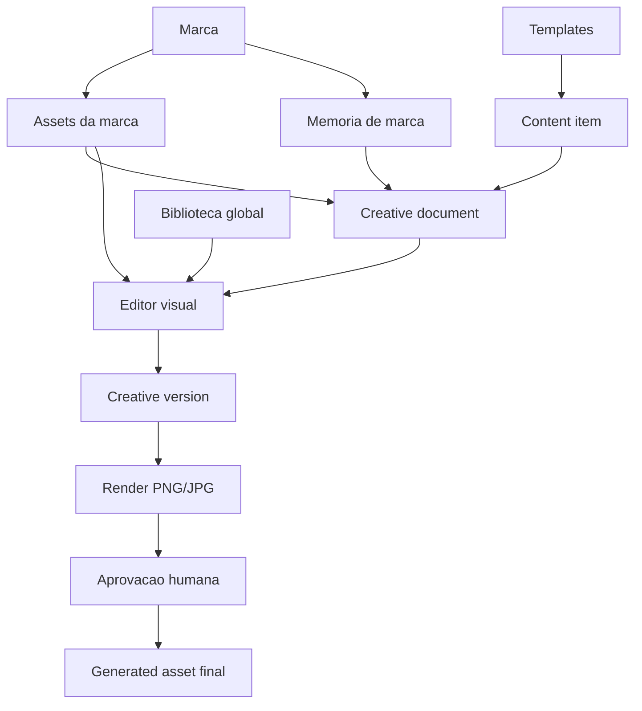

# Plano do MVP de Editor Visual

Atualizado em: 2026-06-02

## 1. Objetivo

Adicionar ao `content-saas` um MVP de editor visual inspirado em Canva, mas com escopo controlado para social media operacional.

O objetivo nao e criar um editor livre completo no primeiro momento. O objetivo e permitir que um designer, social media ou aprovador abra uma peca gerada a partir de template, revise o conteudo, troque assets, ajuste elementos essenciais, gere preview PNG/JPG e envie para aprovacao humana preservando memoria de marca, contratos JSON e render server-side.

## 2. Posicionamento no produto

O editor visual deve ser uma camada entre geracao/render e aprovacao:



O sistema continua sendo um SaaS de automacao de conteudo. O editor visual entra para cobrir o ponto onde a automacao precisa de sensibilidade humana: ajuste de layout, assets, logos, copy e revisao final.

## 3. Estado atual que ja ajuda

Ja existe uma base boa para evoluir:

- `creative_documents` com `document_json`.
- `creative_versions` para historico.
- `creative_renders` para outputs finais.
- `template_placeholders` para campos editaveis.
- `asset_collections` e `global_assets`.
- `brand_assets` para biblioteca da marca.
- `approvals` aceitando `creative_document` e `creative_version`.
- `/editor` e `/editor/[documentId]` com editor assistido inicial.
- Job `render_creative_document`.
- Render service com `/render-document`.
- Contratos Zod para `CreativeDocumentJsonSchema`, elementos, slides e render.

O proximo salto e trocar a experiencia baseada em formularios por uma experiencia visual com canvas e painel de propriedades.

## 4. Escopo do MVP

### 4.1 Deve ter

- Canvas visual com tamanho fixo por formato.
- Abrir documento criativo baseado em template.
- Selecionar elemento no canvas.
- Editar texto de elementos existentes.
- Trocar imagem em placeholder.
- Inserir ou trocar logo da marca em placeholder.
- Buscar assets da marca.
- Buscar assets da biblioteca global.
- Ajustar posicao e tamanho de elementos desbloqueados.
- Preservar elementos bloqueados do template.
- Salvar versoes.
- Gerar preview/final PNG ou JPG.
- Enviar para aprovacao.
- Validar o documento com Zod antes de salvar e antes de renderizar.

### 4.2 Nao deve ter no MVP

- Criacao livre de templates do zero.
- Editor de video.
- Animacoes.
- Colaboracao multiplayer em tempo real.
- Comentarios inline no canvas.
- Marketplace publico de templates.
- IA geradora de imagem.
- Ferramentas avancadas de desenho vetorial.

Essas funcionalidades podem entrar depois. Para o MVP, foco em revisar e finalizar pecas geradas.

## 5. Necessidades criticas do designer

### 5.1 Texto

O designer precisa conseguir ajustar o que mais quebra visualmente uma peca:

- Conteudo do texto.
- Tamanho.
- Peso.
- Alinhamento.
- Cor dentro dos tokens permitidos.
- Altura de linha.
- Caixa alta/baixa.
- Quebra de linha.
- Limite de caracteres por placeholder.

Regras importantes:

- Texto deve avisar quando passar do limite do template.
- Campos obrigatorios nao podem ficar vazios antes da aprovacao.
- Cores fora da identidade devem ser permitidas apenas para admin/editor, ou marcadas como alerta.

### 5.2 Imagens

O designer precisa trocar imagem sem quebrar o layout:

- Selecionar placeholder de imagem.
- Escolher asset da marca.
- Escolher asset global.
- Fazer crop/reposition dentro do frame.
- Alternar `cover` e `contain`.
- Travar proporcao do frame.
- Ver metadados basicos do asset.

Regras importantes:

- O documento deve guardar `asset_source` e `asset_id`, nao apenas URL assinada.
- URLs assinadas devem ser resolvidas pelo render/orchestrator na hora do render.
- Imagens externas devem ser tratadas como excecao e armazenadas depois se forem aprovadas.

### 5.3 Logos

Logo merece tratamento proprio:

- Placeholder de logo separado de imagem comum.
- Busca prioritaria em `brand_assets.category = logo`.
- Opcoes para logo principal, secundario, horizontal, simbolo e monocromatico via `metadata`.
- Preservar proporcao.
- Proteger contra crop acidental.
- Alertar se o logo ficar pequeno demais.

### 5.4 Elementos

No MVP, elementos livres devem ser simples:

- Texto novo.
- Imagem nova.
- Forma simples.
- Icone da biblioteca global.
- Badge/selo.

Mas isso deve vir depois da edicao de placeholders. A primeira entrega pode ser somente edicao de elementos existentes.

### 5.5 Camadas

Mesmo no MVP, o designer precisa entender a estrutura da peca:

- Lista de camadas.
- Nome amigavel por elemento.
- Visibilidade.
- Bloqueio.
- Ordem frente/tras.
- Selecao pelo canvas ou pela lista.

Elementos bloqueados podem ser selecionados para inspecao, mas nao devem permitir movimento/resize.

## 6. Biblioteca de assets

### 6.1 Biblioteca da marca

Usar `brand_assets` como fonte principal:

- Logos.
- Fotos.
- Fontes.
- Referencias.
- Documentos.
- Outros.

Melhorias recomendadas:

- Tags em `metadata.tags`.
- Orientacao em `metadata.orientation`: `square`, `portrait`, `landscape`.
- Variacao de logo em `metadata.logo_variant`.
- Cores detectadas em `metadata.colors`.
- Dimensoes em `metadata.width` e `metadata.height`.
- Status de aprovacao do asset.

### 6.2 Biblioteca global

Usar `global_assets` para assets reutilizaveis:

- Fundos.
- Icones.
- Formas.
- Texturas.
- Mockups.
- Fotos genericas aprovadas.
- Selos e elementos editoriais.

Regra importante:

- Upload para biblioteca global nao deve ser livre para qualquer usuario autenticado.
- O bucket `global-assets` deve aceitar leitura autenticada, mas escrita deve ser feita por admin interno, service role ou fluxo de curadoria.

### 6.3 Busca e filtros

Filtros minimos:

- Origem: marca, workspace, global.
- Categoria.
- Status.
- Orientacao.
- Tags.
- Cor dominante.
- Texto de busca por nome.

Depois:

- Busca semantica por embedding.
- Recomendacao por memoria de marca.
- Recomendacao por placeholder selecionado.

## 7. Biblioteca de templates

### 7.1 Template como contrato

Template nao deve ser apenas HTML. Ele deve ter:

- `schema_json`: campos e slots esperados.
- `render_contract_json`: endpoint, formato e restricoes.
- `template_placeholders`: mapeamento de edicao visual.
- `metadata`: uso recomendado, canal, dimensoes, estilo, densidade visual.

### 7.2 Templates no MVP

No MVP, templates devem ser administrados pelo produto, nao criados livremente pelo usuario.

Fluxo recomendado:

1. Admin cadastra template.
2. Admin define placeholders.
3. Usuario gera ou cria creative document baseado no template.
4. Designer edita apenas os placeholders e elementos liberados.
5. Render final usa o contrato validado.

### 7.3 Template builder futuro

Depois do MVP, criar um builder de templates para usuarios avancados:

- Criar canvas do zero.
- Definir placeholders.
- Definir constraints.
- Salvar como template reutilizavel.
- Publicar para workspace ou biblioteca global.

Isso e uma fase posterior, porque aumenta muito a complexidade do produto.

## 8. Contrato do documento criativo

O `document_json` deve continuar sendo a fonte da verdade. Ele precisa sustentar preview, render, versoes e auditoria.

Estrutura-alvo:

```json
{
  "schema_version": 1,
  "canvas": {
    "width": 1080,
    "height": 1080,
    "format": "instagram_post"
  },
  "template_id": "photo-overlay-01",
  "brand_id": "uuid",
  "content_item_id": "uuid",
  "slides": [
    {
      "id": "slide-1",
      "name": "Capa",
      "background": {
        "color": "#ffffff"
      },
      "elements": [
        {
          "id": "headline",
          "type": "text",
          "role": "headline",
          "placeholder": "headline",
          "locked": false,
          "visible": true,
          "text": "Texto da campanha",
          "x": 80,
          "y": 120,
          "width": 720,
          "height": 160,
          "rotation": 0,
          "style": {
            "font_family": "Inter",
            "font_size": 64,
            "font_weight": 700,
            "color": "#111111",
            "line_height": 1.05,
            "text_align": "left"
          }
        },
        {
          "id": "logo",
          "type": "image",
          "role": "brand_logo",
          "placeholder": "logo",
          "locked": false,
          "visible": true,
          "asset_id": "uuid",
          "asset_source": "brand_asset",
          "x": 80,
          "y": 920,
          "width": 180,
          "height": 80,
          "rotation": 0,
          "style": {
            "fit": "contain"
          }
        }
      ]
    }
  ],
  "tokens": {
    "primary_color": "#14532d",
    "text_color": "#111111",
    "background_color": "#f8fafc"
  }
}
```

Campos que provavelmente precisam entrar no contrato:

- `name` amigavel do elemento.
- `z_index`.
- `opacity`.
- `blend_mode` opcional.
- `constraints` por elemento.
- `crop` para imagens.
- `fit` para imagens.
- `editable` por propriedade.
- `allowed_asset_categories`.

## 9. Arquitetura tecnica recomendada

### 9.1 Frontend

Usar uma biblioteca de canvas React:

- Opcao preferida para MVP: `react-konva`.
- Alternativa: `fabric.js`.

Motivo:

- Selecionar, arrastar e redimensionar elementos e muito trabalhoso no DOM puro.
- Canvas reduz diferenca entre preview no browser e render final.
- React Konva conversa bem com estado controlado e contratos JSON.

Componentes sugeridos:

```text
apps/web/src/app/editor/[documentId]/
  page.tsx
  editor-client.tsx

apps/web/src/components/editor/
  creative-canvas.tsx
  element-transformer.tsx
  layers-panel.tsx
  properties-panel.tsx
  asset-picker.tsx
  template-placeholder-panel.tsx
  version-history.tsx
```

### 9.2 Backend web

Server actions atuais podem evoluir para:

- `updateCreativeDocument`.
- `updateCreativeElement`.
- `createCreativeVersion`.
- `submitCreativeDocumentApproval`.
- `requestCreativeDocumentRender`.
- `createCreativeDocumentFromTemplate`.

O ideal e salvar o documento completo validado, com protecao contra alteracao de elementos bloqueados.

### 9.3 Render

Render final continua fora do browser:

- Web salva documento.
- Web solicita job ao orchestrator.
- Orchestrator cria `creative_renders`.
- Worker resolve signed URLs.
- Worker chama `/render-document`.
- Worker salva PNG/JPG no Storage.
- Worker atualiza status e abre aprovacao, quando aplicavel.

### 9.4 Banco

Tabelas atuais sustentam o MVP, mas estes ajustes sao recomendados:

- Adicionar `z_index` ou ordenar elementos explicitamente no JSON.
- Adicionar `creative_document_events` no futuro para auditoria fina.
- Adicionar `asset_tags` ou normalizar tags se busca crescer.
- Revisar policy de upload em `global-assets`.
- Adicionar seed de templates/placeholders globais.

## 10. Fases de implementacao

### Fase 1 - Editor visual de placeholders

Entrega:

- Canvas com preview visual. Implementado inicialmente com DOM responsivo.
- Selecao de elemento. Implementado inicialmente via canvas e painel de camadas.
- Painel de propriedades basico. Implementado inicialmente para texto, asset e geometria.
- Editar texto. Implementado via server action existente.
- Trocar asset/logo. Implementado via select de assets da marca/global no painel.
- Persistir geometria (`x`, `y`, `width`, `height`, `rotation`). Implementado via server action, ainda sem drag/resize visual com handles.
- Salvar versao. Implementado via server action existente.
- Render final. Implementado via job `render_creative_document`.

Criterio de pronto:

- Um documento demo e um documento real podem ser abertos, editados, versionados e renderizados.

Status atual:

- Parcialmente implementado. Falta drag/resize visual com handles, snap e validacao visual de overflow antes de considerar a fase madura.

### Fase 2 - Biblioteca de assets dentro do editor

Entrega:

- Picker lateral de assets.
- Filtros por origem, categoria, status e busca.
- Priorizacao de logos em placeholders de logo.
- Preview de imagens via signed URL.
- Biblioteca global em aba separada.

Criterio de pronto:

- Designer consegue trocar imagem/logo sem sair do editor.

### Fase 3 - Movimento e resize controlado

Entrega:

- Drag de elementos desbloqueados.
- Resize com handles.
- Snap basico.
- Bloqueio respeitado.
- Persistencia de `x`, `y`, `width`, `height`, `rotation`.

Criterio de pronto:

- Designer consegue corrigir composicao sem quebrar elementos travados do template.

### Fase 4 - Camadas e elementos simples

Entrega:

- Painel de camadas.
- Reordenar elementos.
- Mostrar/ocultar.
- Adicionar texto.
- Adicionar imagem.
- Adicionar forma/icone.

Criterio de pronto:

- Designer consegue fazer ajustes alem dos placeholders, ainda dentro de limites claros.

### Fase 5 - Regras de marca e QA visual

Entrega:

- Avisos de texto estourado.
- Avisos de contraste.
- Avisos de logo pequeno/cortado.
- Avisos de cor fora dos tokens.
- Checklist antes de aprovacao.

Criterio de pronto:

- A aprovacao recebe uma peca com alertas e evidencias minimas de conformidade.

### Fase 6 - Busca inteligente e recomendacoes

Entrega:

- Recomendacao de assets por placeholder.
- Busca semantica.
- Sugestao de variacao de copy.
- Sugestao de template para content item.

Criterio de pronto:

- O sistema reduz tempo de escolha sem tirar controle do designer.

## 11. Priorizacao sugerida

Ordem pratica para o proximo ciclo:

1. Criar editor client com canvas real usando React Konva.
2. Mover preview atual de DOM para componente de canvas.
3. Implementar selecao e painel de propriedades.
4. Trocar texto e asset dentro do canvas.
5. Adicionar asset picker com biblioteca da marca/global.
6. Persistir documento completo com validacao Zod.
7. Validar render final com documento alterado.
8. Revisar policy de escrita do bucket `global-assets`.
9. Criar testes de contrato do documento criativo.
10. Criar seed real de template/placeholders/assets para Supabase local.

## 12. Riscos

### 12.1 Escopo virar Canva completo

Risco:

- O produto pode perder foco tentando copiar todas as ferramentas do Canva.

Mitigacao:

- MVP deve ser template-first, placeholder-first e brand-first.

### 12.2 Divergencia entre canvas e render final

Risco:

- O que o usuario ve no editor pode nao bater com PNG/JPG final.

Mitigacao:

- Manter o `document_json` como fonte unica.
- Usar medidas absolutas.
- Render final deve usar o mesmo contrato.
- Criar smoke tests de render por documento criativo.

### 12.3 Assets globais sem governanca

Risco:

- Qualquer usuario autenticado pode inserir material em biblioteca global.

Mitigacao:

- Restringir upload global a admin/service role.
- Manter upload de marca/workspace separado.
- Adicionar fluxo de curadoria.

### 12.4 Complexidade de RLS

Risco:

- Biblioteca global, workspace e marca misturam escopos diferentes.

Mitigacao:

- Regras claras:
  - global: leitura autenticada, escrita administrativa.
  - workspace: leitura/escrita por membros autorizados.
  - brand: leitura/escrita por membros autorizados do workspace.

### 12.5 Performance

Risco:

- Muitos assets e imagens pesadas tornam o editor lento.

Mitigacao:

- Thumbnails.
- Paginacao.
- Signed URLs curtas.
- Upload com metadata de dimensoes.
- Lazy loading no picker.

## 13. Decisoes recomendadas

- Comecar com editor de placeholders, nao template builder.
- Usar React Konva para o canvas do web.
- Manter render final no `apps/render`.
- Usar `document_json` versionado como fonte da verdade.
- Separar biblioteca da marca de biblioteca global.
- Tratar upload global como curadoria/admin.
- Validar tudo com Zod antes de persistir.
- Abrir aprovacao a partir de `creative_document` ou `creative_version`, nao apenas de imagem final.

## 14. Definition of Done do MVP

O MVP simples esta pronto quando:

- Usuario abre um creative document.
- Canvas mostra a peca em formato real.
- Usuario seleciona um elemento.
- Usuario edita texto.
- Usuario troca imagem/logo por asset da marca.
- Usuario troca imagem/elemento por asset global.
- Usuario move/redimensiona elemento desbloqueado.
- Usuario salva versao.
- Usuario renderiza PNG/JPG.
- Usuario envia para aprovacao.
- Aprovador ve o alvo correto na central de aprovacoes.
- Documento e render passam pelos contratos Zod.
- RLS impede acesso entre workspaces.
- Build, typecheck e testes passam.
