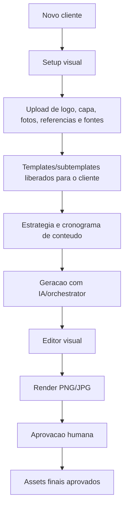

# Plano de Redesenho Cliente-First

Atualizado em: 2026-06-03

## 1. Norte do redesenho

O produto deve deixar de parecer uma colecao de formularios e virar uma operacao guiada por cliente.

Fluxo desejado:

No banco atual, `brands` representa o cliente/marca operacional. O redesenho pode manter essa tabela e mudar a experiencia para chamar o conceito de `cliente` na UI, sem quebrar os contratos existentes.

## 2. Entidades de produto

- Workspace: conta/operacao que contem varios clientes.
- Cliente: hoje `brands`; guarda nome, segmento, posicionamento, voz e identidade visual em `metadata.identity`.
- Assets do cliente: hoje `brand_assets`; inclui logo, fotos, capas, referencias, documentos e fontes.
- Biblioteca global: hoje `global_assets`; assets curados do produto.
- Templates/subtemplates: hoje `templates`, `brand_templates` e `template_placeholders`.
- Estrategia/cronograma: hoje `content_plans` e `content_items`.
- Criativos editaveis: hoje `creative_documents` e `creative_versions`.
- Outputs finais: hoje `generated_assets` e `creative_renders`.
- Aprovacoes: hoje `approvals`.

## 3. UX alvo por etapa

### 3.1 Painel de clientes

Deve ser a home operacional depois do login.

Precisa mostrar:

- Lista de clientes.
- Progresso do setup.
- Status de perfil, identidade, assets, templates, estrategia e criativos.
- Atalhos para abrir painel, assets, estrategia e editor.
- Acao clara para novo cliente.

Primeira entrega implementada:

- Rota `/clients`.
- Formulario de novo cliente com nome, segmento, cores RGB/HEX, fonte, posicionamento, voz e observacoes visuais.
- Cards de clientes com progresso e atalhos.

### 3.2 Onboarding do cliente

Precisa virar um wizard natural:

1. Perfil: nome, segmento, oferta, publico, objetivo.
2. Identidade: cores RGB/HEX, fonte da biblioteca, upload de fonte, notas visuais.
3. Assets: logo PNG/SVG, capa, fotos, referencias, documentos.
4. Templates: escolher/subir templates e mapear placeholders.
5. Estrategia: objetivo editorial, canais, frequencia e calendario inicial.
6. Revisao: checklist antes de gerar memoria/cronograma.

### 3.3 Assets e identidade

Campos criticos:

- Logo principal.
- Logo secundario.
- Capa/fundo.
- Fotos aprovadas.
- Referencias visuais.
- Fontes de biblioteca.
- Upload de fonte.
- Cor primaria.
- Cor secundaria.
- Cores auxiliares.
- Regras de uso da marca.

Banco recomendado:

- Usar `brand_assets.category = logo | photo | font | reference | document | other`.
- Guardar `metadata.identity` em `brands`.
- Guardar dimensoes, tags, variante de logo e orientacao em `brand_assets.metadata`.

### 3.4 Templates/subtemplates

Fluxo desejado:

- Cliente recebe templates globais sugeridos.
- Usuario pode vincular templates ao cliente.
- Usuario pode subir subtemplates ou criar placeholders.
- Cada template tem slots obrigatorios para logo, imagem, headline, CTA e cor.
- Editor visual abre sempre a partir de um `creative_document`.

### 3.5 Estrategia e cronograma

O formulario de estrategia deve alimentar `generate_content_plan`.

Campos alvo:

- Objetivo.
- Periodo.
- Canais.
- Frequencia.
- Pilares de conteudo.
- Ofertas/campanhas.
- Tom.
- Restricoes.
- Templates preferidos.

Saida:

- `content_plans`.
- `content_items`.
- Possivel transicao para preview/editor.

### 3.6 Geracao e aprovacao

Fluxo alvo:

1. Gerar memoria de marca.
2. Gerar cronograma.
3. Gerar previews.
4. Abrir no editor visual.
5. Renderizar PNG/JPG.
6. Enviar para aprovacao.

Todos os botoes devem deixar claro:

- O que vai ser criado.
- Qual job sera disparado.
- Onde acompanhar status.
- Qual proximo passo.

## 4. Checklist de revisao das paginas

- `/`: deve levar para `/clients`.
- `/clients`: painel principal do cliente.
- `/brands/[brandId]`: painel interno do cliente.
- `/brands/[brandId]/onboarding`: wizard completo.
- `/brands/[brandId]/assets`: upload estruturado e biblioteca.
- `/templates`: biblioteca global/workspace.
- `/plans`: estrategia e cronogramas.
- `/plans/[planId]`: itens, previews e transicao para editor.
- `/editor`: documentos criativos.
- `/editor/[documentId]`: editor visual.
- `/approvals`: decisoes humanas.
- `/jobs`: status operacional e retry.

## 5. Proximas entregas recomendadas

1. Transformar `/brands/[brandId]/onboarding` em wizard com identidade, assets, templates e estrategia.
2. Melhorar `/brands/[brandId]/assets` para upload de logo/capa/fonte com metadata.
3. Criar vinculacao de templates por cliente em `brand_templates`.
4. Evoluir `/plans` para briefing estrategico guiado por cliente.
5. Conectar criacao de `creative_documents` a partir de item/template.
6. Adicionar testes de botoes principais no web.
7. Rodar Supabase local/real para validar RLS e Storage de ponta a ponta.

